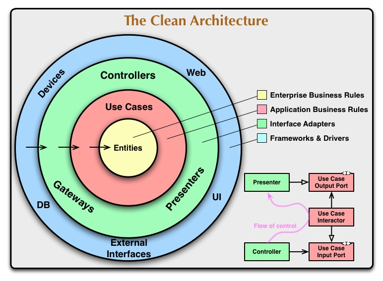
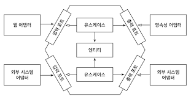

# 만들면서 배우는 클린 아키텍처
## 1.계층형 아키텍쳐의 문제는 무엇일까?
#### 계층형 아키텍쳐는 데이터베이스 주도 설계를 유도한다.
웹 계층(컨트롤러) -> 도메인 계층(서비스) -> 영속성 계층(엔티티, 레포지토리) <br>
자연스럽게 영속성 계층에 의존하게 된다 <br>

영속성 중심적인 아키텍처가 만들어지는 가장 큰 원인은 ORM 때문이다 <br>

#### 지름길을 택하기 쉬워진다.
#### 테스트하기 어려워진다.
- 웹 계층 테스트에서 도메인 계층 뿐만 아니라, 영속성 계층도 Mocking 이 필요하다 -> 단위 테스트의 복잡도가 올라간다.<br>
#### 동시 작업이 어려워진다.

<br>

## 2.의존성 역전하기
계층형 아키텍쳐에 대한 대안을 이야기 해보자 <br>
먼저 단일책임원칙 과 의존성 역전 원칙에 대하여 알아보자 <br>

#### 단일책임원칙(SRP)
하나의 컴포넌트는 오로지 한가지 일만 해야하고, 그것을 올바르게 수행해야한다 는 원칙이다 <br>
좀 더 풀어서 자세히 설명하면, '컴포넌트를 변경하는 이유는 오직 하나뿐이어야 한다' <br>

컴포넌트를 변경할 이유가 오로지 한가지라면 어떤 다른 이유로 소프트웨어을 변경하더라도 컴포넌트에 대하여 전혀 신경 쓸 필요가 없다 <br>

#### 의존성 역전 원칙(DIP)
계층형 아키텍쳐에서 계층 간 의존성은 항상 다음 계층인 아래 방향을 가리킨다 <br>
즉 영속성 계층에 대한 도메인 계층의 의존성 때문에 영속성 계층을 변경할 때마다 잠재적으로 도메인 계층도 변경해야 한다 <br>

하지만 도메인 코드는 애플리케이션에서 가장 중요한 코드다. 영속성 코드가 바뀐다고 해서 도메인 코드도 변경되서는 안됀다 <br>

위 의존성을 어떻게 제거할 수 있을까?<br>
-> 의존성 역전 원칙을 사용한다 <br>

#### 클린 아키텍처
클린아키텍처에서는 설계가 비즈니스 규칙의 테스트를 용이하게 하고, 비즈니스 규칙은 프레임워크, 데이터베이스 UI 기술, 그 밖의 외부 어플리케이션이나 인터페이스로부터 독립적일 수 있다 <br>

이는 도메인 코드가 바깥으로 향하는 어떤 의존성도 없어야 함을 의미한다 <br>
대신 의존성 역전 원칙의 도움으로 모든 의존성이 도메인 코드를 향하고 있다 <br>


위 아키텍처에서 가장 주요한 규칙은 의존성 규칙으로, 계층 간의 모든 의존성이 안쪽으로 향해야 한다는 것이다 <br>

위 아키텍처의 코어에는 주변 유스케이스에서 접근하는 도메인 엔티티들이 있다 <br>
유스케이스는 앞에서 서비스라고 불렀던 것들인데, 단일 책임을 갖기 위해 조금 더 세분화 되어 있다 <br>

#### 헥사고날 아키텍처
 <br>
육각형 안에는 도메인 엔티티와 이와 상호작용하는 유스케이스가 있다 <br>
육각형에서는 외부로 향하는 의존성이 없기 때문에 클린 아키텍처에서 제시한 의존성 규칙이 그대로 적용되며, 대신 모든 의존성은 코어를 향한다 <br>

육각형 외부에는 애플리케이션과 상호작용하는 다양한 어댑터들이 있다 <br>
ex) 웹 어댑터, 외부 시스템 어댑터, 데이터베이스 어댑터 <br>

애플리케이션 코어와 어댑터들 간의 통신이 가능하려면 애플리케이션 코어가 각각의 포트를 제공해야 한다 <br>
유사하게 포트 어댑터 아키텍처로도 불린다 <br>

## 코드 구성하기
코드를 구조화 하는 방법
- 계층으로 구성하기 ex) domain, persistence, web
  - 기능이 많아짐에 따라 뭐가 뭔지 파악하기 어렵다
- 기능으로 구성하기 ex) send_account, payment
  - 가시성이 떨어짐
- 육각형 아키텍쳐로 구성
  - 기능으로 대표 패키지 구성
  - 그 안에 내부를 adapter, domain, application(UseCase, port) 로 구성

#### 의존성 주입의 역할 
애플리케이션 계층이 인커밍/아웃고잉 어댑터에 의존성을 가지면 안된다 <br>

영속성 어댑터 같이 아웃고잉 어댑터에 대해서는 제어 흐름의 반대 방향으로 의존성을 돌리기 위해 의존성 역전 원칙을 이용해야 한다 <br>
-> 애플리케이션 계층에 인터페이스를 만들고 어댑터에 해당 인터페이스 구현체를 두면 된다 <br>

육각형 아키텍처에서는 이 인터페이스가 포트 역할을 한다<br>

모든 계층에 의존성을 가진 중립적인 컴포넌트를 하나 도입하는 것이다. <br>
이 컴포넌트는 아키텍처를 구성하는 대부분의 클래스를 초기화하는 역할을 한다 <br>

## UseCase 구현하기
- 입력을 받는다
- 비즈니스 규칙을 검증한다
- 모델 상태를 조회한다
- 출력을 반환한다.

UseCase 는 인커밍 어댑터로부터 입력을 받는다. <br>
UseCase 는 비즈니스 규칙을 검증할 책임이 있다 <br>

그리고 도메인 엔티티와 이 책임을 공유한다 <br>

비즈니스 규칙을 충족하면 유스케이스는 입력을 기반으로 어떤 방법으로든 모델의 상태를 변경한다 <br>

아웃고잉 어댑터에서 온 출력값을 반환할 출력 객체로 변환하는 것이다 <br>

Service 는 **인커밍 포트**인 인터페이스(=SendMoneyUseCase) 를 구현한다 <br>
그리고  계좌를 불러오기 위해 **아웃고잉 포트** 인터페이스(=LocalAccountPort) 를 호출한다 <br>

즉 하나의 서비스가 하나의 유스케이스 구현을 통해 도메인 모델 변경 및 변경 상태를 저장하기 위해 아웃고잉 포트를 호출한다 <br>

#### 1. 입력 유효성 검증
유효성 검증은 UseCase 가 아닌 입력 모델(=Command)에서 검증을 해야한다 <br>
검증은 여러방법이 있다, 메소드 or 생성자 등등 <br>

```java
public record SendMoneyCommand(
        AccountId sourceAccountId,
        AccountId targetAccountId,
        Money money
) {
    public SendMoneyCommand(AccountId sourceAccountId, AccountId targetAccountId, Money money) {
        this.sourceAccountId = sourceAccountId;
        this.targetAccountId = targetAccountId;
        this.money = money;
        
        requireNonNull(sourceAccountId);
        requireNonNull(targetAccountId);
        requireNonNull(money);
        requireGreaterThan(money,0);
        
    }
}
```

final 클래스로 만들어 필드 값을 불변 상태로 만들어도 좋지만, 보일러 플레이트 코드를 방지하기 위해 record 를 사용하였다 <br> 
Command 객체는 UseCase 의 일부이기 때문에 port 패키지에 in 안에 작성해두었다 <br>

Validation 은 Java Bean의 Validation API 들이 있따, SelfValidation<T> 구현체를 상속 받아서 유효성 검증을 할 수 있다 <br>

#### 2. UseCase 마다 다른 입력 모델


Git: https://github.com/Hyeonqz/Hyeonq-Lab/tree/master/architecture-lab
